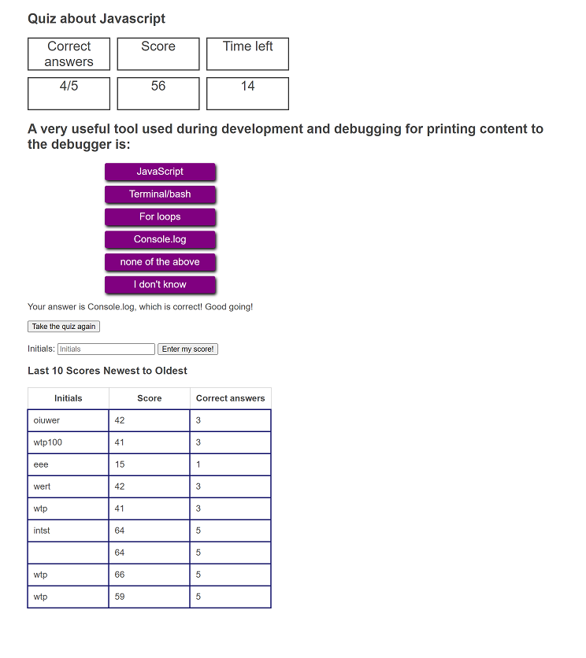

# 05-Quiz
# The Quiztronic Quiz Master
  
## Description
This web page is a timed quiz on Javascript fundamentals. Scores are stored. 
This is a work in progress. The Javascript programming was a challenge.

## Installation
This project uses only HTML, CSS and Javascript so it will run without any other APIs

## Usage
After the web page appears, click the button with the text "Start first question!". After clicking the first question appears. The countdown timer starts at 15. You have 15 seconds from the start of countdown to click a button. If you answer correctly you the number of seconds left in the countdown is added to the score. If the answer is wrong the score is unchanged. If you click the answer "I don't know" then the score is unchanged. The countdown clock stops when you click an answer or the clock goes to zero. There are 4 questions to the highest score is 4x15 or 60. If you answered correctly you are told that. If you answered incorrectly you are told that and the correct answer. Click the Next button to go the next question. After the last question is answered or times out you will see a label and text box for your initials. If you enter your initials and click the "Enter my score" button your initials, score and number of correct answers will appear.

Here are the questions and correct answers. 
1. Which of the following is not valid for alight-items? Bottom 
2. Which of the following is not valid for justify-content? none of the above 
3. What is the best food while coding Javascript? Pasta 
4. What is the name of your Javascript instructor? Ant 

Provide instructions and examples for use. Include screenshots as needed.
To add a screenshot, create an `assets/images` folder in your repository and upload your screenshot to it. Then, using the relative filepath, add it to your README using the following syntax:
    

## Needed improvements
1. Questions about Javascript are needed. The ones here were made up on the spot and could not be improved because of limited time.
2. The formatting is hideous and could be greatly improved.
3. The table of scores are just the last 10. This should be sorted greatest to least but could not be done because of limited time.
4. The formatting of scores table is awful.
5. The scores table does not work right. Need to fix.

## License
MIT License

Copyright (c) [2021] [William T. Pate]

Permission is hereby granted, free of charge, to any person obtaining a copy
of this software and associated documentation files (the "Software"), to deal
in the Software without restriction, including without limitation the rights
to use, copy, modify, merge, publish, distribute, sublicense, and/or sell
copies of the Software, and to permit persons to whom the Software is
furnished to do so, subject to the following conditions:

The above copyright notice and this permission notice shall be included in all
copies or substantial portions of the Software.

THE SOFTWARE IS PROVIDED "AS IS", WITHOUT WARRANTY OF ANY KIND, EXPRESS OR
IMPLIED, INCLUDING BUT NOT LIMITED TO THE WARRANTIES OF MERCHANTABILITY,
FITNESS FOR A PARTICULAR PURPOSE AND NONINFRINGEMENT. IN NO EVENT SHALL THE
AUTHORS OR COPYRIGHT HOLDERS BE LIABLE FOR ANY CLAIM, DAMAGES OR OTHER
LIABILITY, WHETHER IN AN ACTION OF CONTRACT, TORT OR OTHERWISE, ARISING FROM,
OUT OF OR IN CONNECTION WITH THE SOFTWARE OR THE USE OR OTHER DEALINGS IN THE
SOFTWARE.

## Badges

Check out the badges hosted by [shields.io](https://shields.io/). You may not understand what they all represent now, but you will in time.

## Tests
Go the extra mile and write tests for your application. Then provide examples on how to run them here.